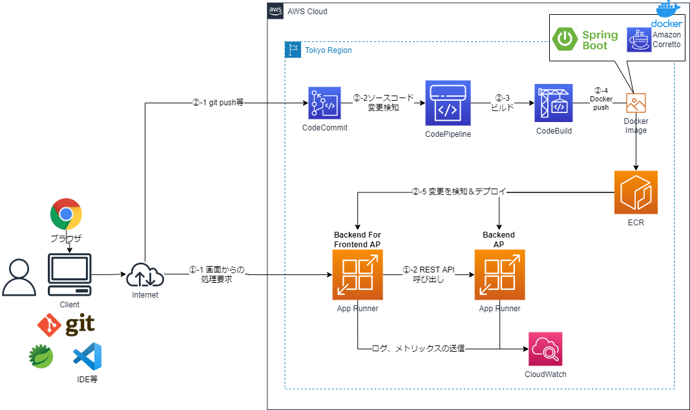

# SpringBoot APをECRとAppRunnerで動作させるCloudFormationサンプルテンプレート

## 構成
* システム構成図



* CI/CD、コンテナ起動はAppRunnerで実現
    * イメージリポジトリをECRで管理し、Docker PushするとAppRunnerでデプロイ
        * AppRunnerがサポートするソースコードリポジトリは現状GitHubのみであることからCodeCommitでのソースコード管理を想定した構成
        * https://docs.aws.amazon.com/ja_jp/apprunner/latest/dg/architecture.html
* メトリックスのモニタリング
    * AppRunnerの機能で実現
        * https://docs.aws.amazon.com/ja_jp/apprunner/latest/dg/monitor-cw.html
* ログの転送
    * AppRunnerの機能でCloudWatch Logsへログ出力
        * https://docs.aws.amazon.com/ja_jp/apprunner/latest/dg/monitor-cwl.html
* オートスケーリング
    * AppRunnerの機能で実現
        * https://docs.aws.amazon.com/ja_jp/apprunner/latest/dg/manage-autoscaling.html
    * 現在、CloudFormationでは、AutoScalingConfigurationのリソースが作成不可なのでデフォルトのオートスケーリング設定
* VPCコネクタによるVPC内のリソースアクセス
    * VPCコネクタにより、パブリックでないRDS等のVPCリソースへのアクセスが可能
        * TODO: 本サンプルでは未実施        
    * インバウンドトラフィックには利用できないので、インバウンドトラフィックは従来どおりパブリックなアクセスのみ、IP等でのアクセス制限もできないのでAppRunnerは完全閉域な構成には向かない

## IAM
### 1. IAMの作成
```sh
aws cloudformation validate-template --template-body file://cfn-iam.yaml
aws cloudformation create-stack --stack-name IAM-Stack --template-body file://cfn-iam.yaml --capabilities CAPABILITY_NAMED_IAM
```
* CodePipeline、CodeBuildのArtifact用、キャッシュ用のS3バケット名を変えるには、それぞれのcnスタック作成時のコマンドでパラメータを指定する
    * 「--parameters ParameterKey=ArtifactS3BucketName,ParameterValue=(バケット名)」
    * 「--parameters ParameterKey=CacheS3Location,ParameterValue=(パス名)」

## CI環境
### 1. アプリケーションのCodeCommit環境
* 別途、以下の2つのSpringBootAPのプロジェクトが以下のリポジトリ名でCodeCommitにある前提
  * backend-for-frontend
    * BFFのAP
    * backend-for-frontendという別のリポジトリに資材は格納
  * backend
    * BackendのAP
    * backendという別のリポジトリに資材は格納

### 2. ECRの作成
```sh
aws cloudformation validate-template --template-body file://cfn-ecr.yaml
aws cloudformation create-stack --stack-name ECR-Stack --template-body file://cfn-ecr.yaml
```

### 3. CodeBuildのプロジェクト作成
```sh
aws cloudformation validate-template --template-body file://cfn-bff-codebuild.yaml
aws cloudformation create-stack --stack-name BFF-CodeBuild-Stack --template-body file://cfn-bff-codebuild.yaml
aws cloudformation validate-template --template-body file://cfn-backend-codebuild.yaml
aws cloudformation create-stack --stack-name Backend-CodeBuild-Stack --template-body file://cfn-backend-codebuild.yaml
```
* 取得したMavenリポジトリをS3にキャッシュする。キャッシュ用のS3のパス（バケット名/プレフィックス）を変えるには、それぞれのcfnスタック作成時のコマンドでパラメータを指定する
    * 「--parameters ParameterKey=CacheS3Location,ParameterValue=(パス名)」

### 4. CodePipelineの作成
```sh
aws cloudformation validate-template --template-body file://cfn-bff-codepipeline.yaml
aws cloudformation create-stack --stack-name Bff-CodePipeline-Stack --template-body file://cfn-bff-codepipeline.yaml

aws cloudformation validate-template --template-body file://cfn-backend-codepipeline.yaml
aws cloudformation create-stack --stack-name Backend-CodePipeline-Stack --template-body file://cfn-backend-codepipeline.yaml
```
* Artifact用のS3バケット名を変えるには、それぞれのcfnスタック作成時のコマンドでパラメータを指定する
    * 「--parameters ParameterKey=ArtifactS3BucketName,ParameterValue=(バケット名)」  

### 5. ECRへアプリケーションの最初のDockerイメージをプッシュ
* CodePipelineの作成後、パイプラインが自動実行されるので、ビルド実行し、ECRにDockerイメージがプッシュされる。

## AppRunner環境

### 1. AppRunnerの作成
* Backendアプリケーションの起動
```sh
aws cloudformation validate-template --template-body file://cfn-apprunner-backend.yaml

aws cloudformation create-stack --stack-name APPRUNNER-BACKEND-Stack --template-body file://cfn-apprunner-backend.yaml
```

* BFFアプリケーションの起動
```sh
aws cloudformation validate-template --template-body file://cfn-apprunner-bff.yaml
aws cloudformation create-stack --stack-name APPRUNNER-BFF-Stack --template-body  file://cfn-apprunner-bff.yaml
```

### 2. APの実行確認
* Backendアプリケーションの確認
  * ブラウザで「http://(AppRunnerのDNS名)/backend-for-frontend/index.html」を入力しフロントエンドAPの画面が表示される
    * CloudFormationの「APPRUNNER-BACKEND-Stack」スタックの出力「BackendServiceURI」のURLを参照

* BFFアプリケーションの確認    
  * ブラウザで「http://(AppRunnerのDNS名)/backend-for-frontend/index.html」を入力しフロントエンドAPの画面が表示される
    * CloudFormationの「APPRUNNER-BFF-Stack」スタックの出力「BffServiceURI」のURLを参照

### 3. CI/CDの確認
* ソースコードの変更
  * 何らかのソースコードの変更を加えて、CodeCommitにプッシュする
  * CodePipelineのパイプラインが実行され、ECRに新しいDockerイメージがプッシュされることで、AppRunnerに新しいイメージがデプロイされることを確認する


## ネストされたスタックテンプレート
* 今までの構築手順を１つにまとめて実行したい場合は、以下のネストされたテンプレートを実行する。
    * 実行前にCloudFormationの資材をアップロードするためのS3バケットを用意すること
```sh
#S3に資材をアップロード
aws cloudformation package --template-file cfn-root-stack.yaml --s3-bucket (S3バケット名) --output-template-file cfn-artifact.yaml

#ネストされたテンプレートの実行
aws cloudformation deploy --template-file cfn-artifact.yaml --stack-name APPRUNNER-ROOT-STACK --capabilities CAPABILITY_NAMED_IAM
```
* CodeBuildのキャッシュ用のS3のパス（バケット名/プレフィックス）を変えるには、それぞれのcfnスタック作成時のコマンドでパラメータを指定する
「--parameters ParameterKey=CacheS3Location,ParameterValue=(パス名)」
* CodePipelineのArtifact用のS3バケット名を変えるには、それぞれのcfnスタック作成時のコマンドでパラメータを指定する 「--parameters ParameterKey=ArtifactS3BucketName,ParameterValue=(バケット名)」
* 実装が簡易のため、上記のパラメータ以外で、個々のテンプレートにある全パラメータの指定まで実装していないので、カスタマイズ修正要
